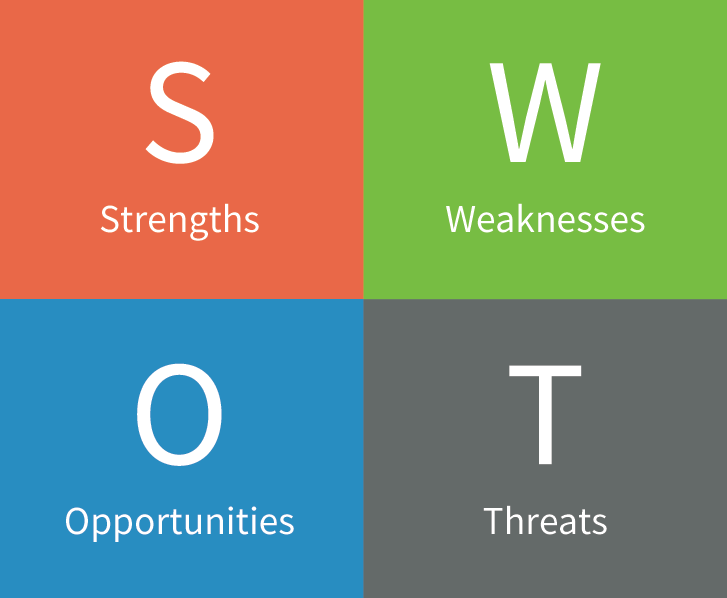

# Learning Management System
>A learning management system (LMS) is a software application for the administration, documentation, tracking, reporting and delivery of educational courses or training programs.They help the instructor deliver material to the students and other assignments, track student progress, and manage record-keeping. LMSs are focused on online learning delivery but support a range of uses, acting as a platform for fully online courses, as well as several hybrid forms, such as blended learning and flipped classrooms. LMSs can be complemented by learning technologies such as a training management system to manage instructor-led training or a Learning Record Store to store and track learning data.

## Purpose
An LMS delivers and manages instructional content, and typically handles student registration, online course administration, and tracking, and assessment of student work. Some LMSs help identify progress towards learning or training goals. Most LMSs are web-based, to facilitate access. LMSs are often used by regulated industries (e.g. financial services and biopharma) for compliance training.

## SWOT

